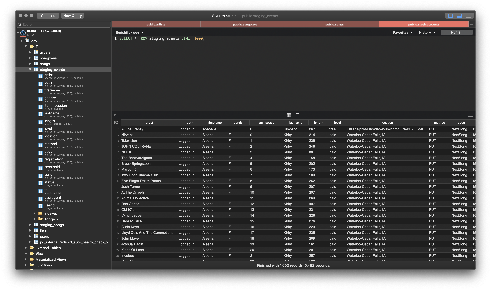
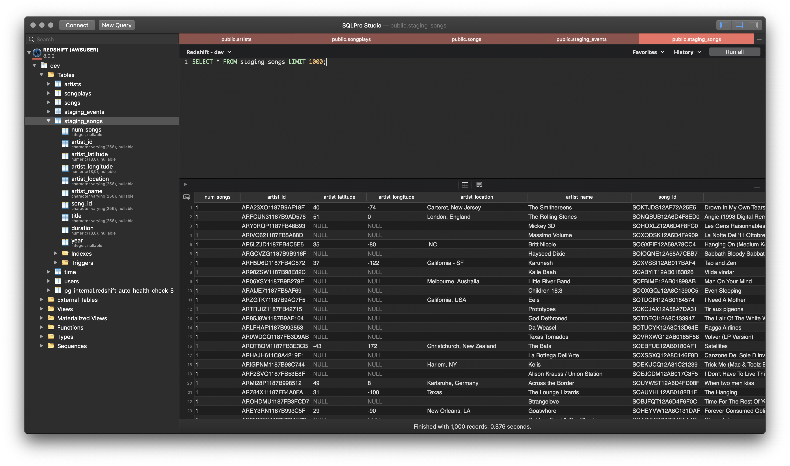
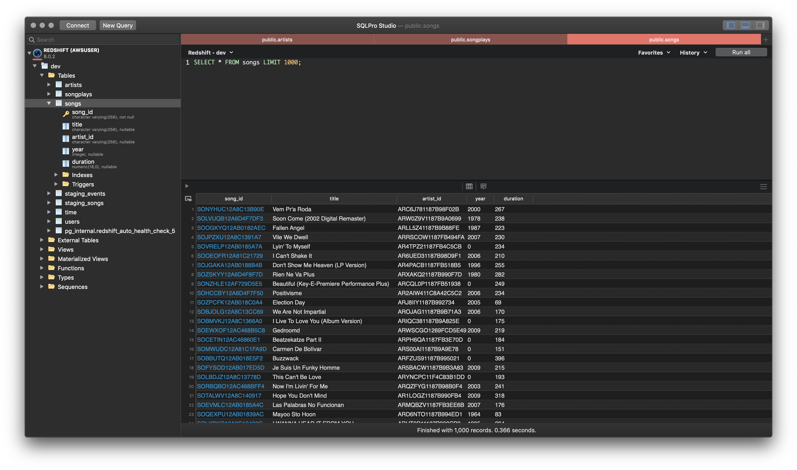
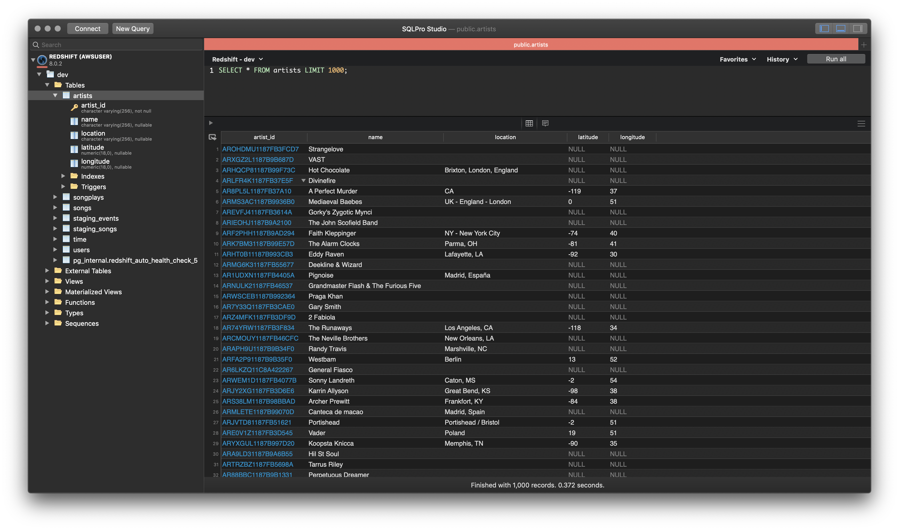
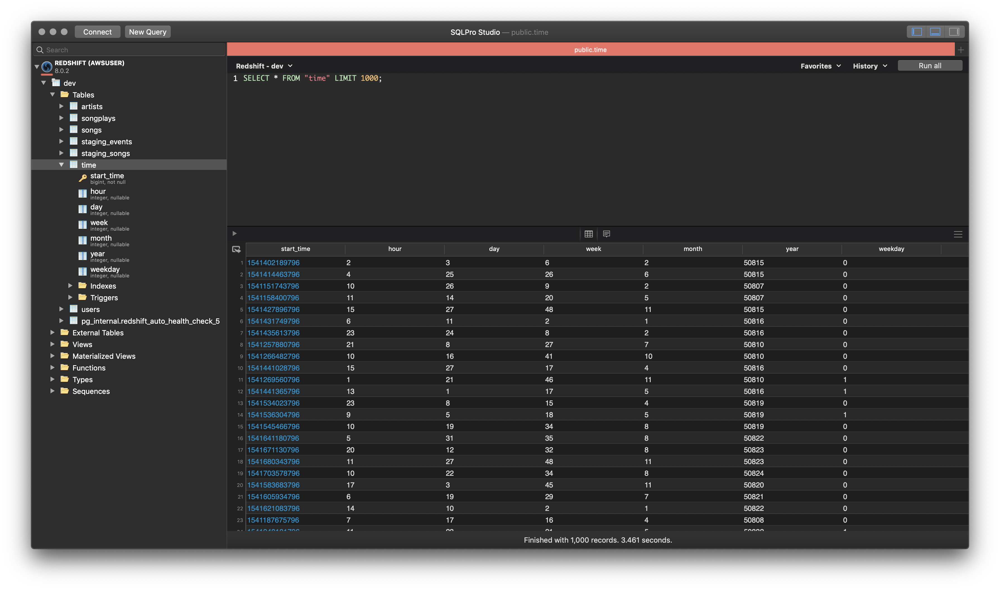
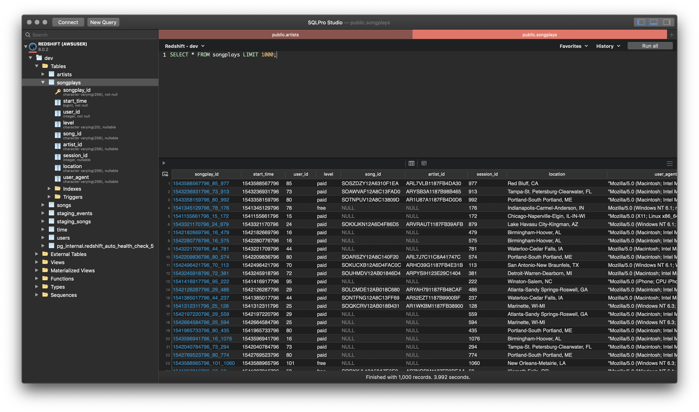
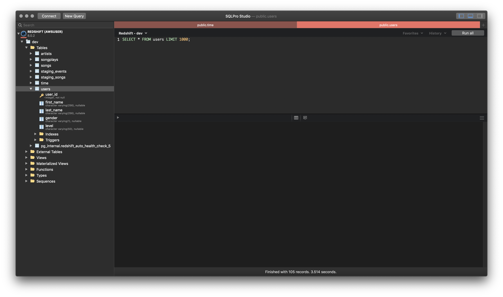

Purpose of Project
------------------

Create an ETL pipeline to parse song and log data and store them into a an sql database to be queried in order gain meaningful analytics for stake holders.

Steps:

1. Design and deploy a database schema focusing on app events as the base (Fact Table) and use descriptive data about the event as dimension tables.
2. Parse song and log data and insert them into the fact/dimension tables.
3. Make sure duplicate items such as user and artists are updated instead of duplicated.

Schema:

This database schema was created to minimize duplcate data and allow various aggregations based on "NextSong" logs.

How to Run ETL:

1. First time you will need to run create_tables.py. This will create all the table structure that are needed.
2. On a scheduled basis you can run etl.py. This will update the staging tables with new data. The staging tables will then be used to fill out the fact and dimension tables.
3. When etl.py is run, data from staging goes into temp tables. From here, duplicates are updated then removed from the temp table. After duplicates are removed, new entries are added into the fact and dimension tables.
* Note - Normally the fact table does not get updates, but in this case many of the song and artist ids have nulls since the data is missing from the dimensions. I set it up so these values get updated in the event the dimension tables get updated for completeness.

Events Staging

Songs Staging

Songs Table

Artists Table

Time Table

Song Plays Table

Users Table

Sample Queries and Results:

1. Most songplays by level:

SELECT sp.level, count(*) from songplays sp group by sp.level

| Level | Count |
| ----- | ----- |
| free  | 1277  |
| paid  | 5877  |

2. What hour has the most song plays:

SELECT t.hour, count(*) from songplays sp
left join time t on
t.start_time = sp.start_time
group by t.hour
order by count DESC

**Hour**|** Plays**
:-----:|:-----:
23|330
4|329
5|328
15|325
12|322
20|310
13|310
10|309
16|305
11|301
19|295
14|293
7|293
2|289
6|288
17|287
0|287
1|284
21|282
3|282
22|278
18|277
9|276
8|274

